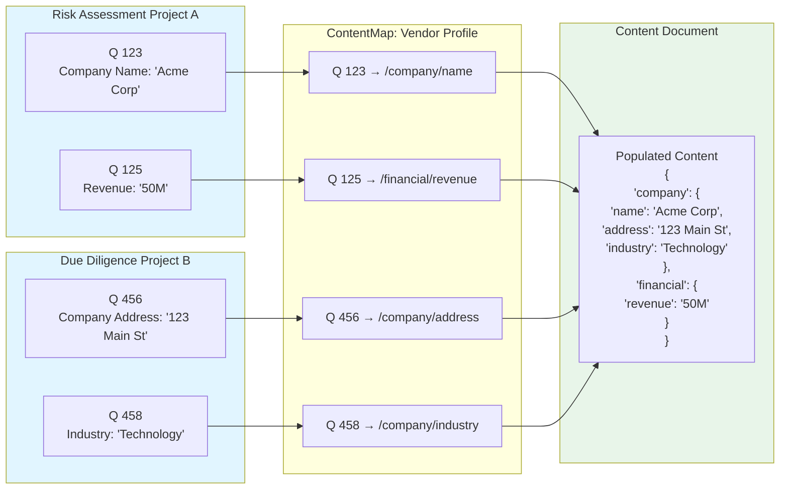

::: tip From Assessment to Action
The information you gather through questionnaires needs to end up in business documents—contracts, reports, agreements, and reference databases. Fluvial eliminates the manual copying and pasting by automatically connecting questionnaire responses to the documents you need to create.
:::

## The Challenge

Most platforms stop at collecting data. After that, you're left copying information by hand into contracts, reports, and other documents. This wastes time, introduces errors, and makes updates difficult when information changes.

## How Fluvial Works

Fluvial treats documents as living connections to your questionnaire data, not one-time exports.

### Define Your Document Structure

Create templates for the types of documents you need—vendor profiles, compliance reports, service agreements, or rating summaries. These templates define what information each document contains and how it should be organised.

### Connect Questions to Documents

Set up reusable connections between your questionnaire questions and document fields. When a question asks for a company name, certification status, or risk rating, you specify where that information should appear in your documents. These connections can be saved and used again for future assessments.



### Generate and Update Documents

Once connections are established, Fluvial can automatically create documents from questionnaire responses. When source information changes, you can choose to update the documents automatically or review changes before approving them. The system keeps track of what changed, when, and why.

### Share in Any Format

While Fluvial stores document data in a structured way, you can output documents in whatever format you need—PDF for distribution, HTML for web viewing, or data feeds for other systems. Your branding and formatting preferences are maintained in customizable templates.

## Building Organisational Knowledge

Beyond individual projects, Fluvial helps you build a reference library of information that grows more valuable over time. Organise documents by the entities they describe (vendors, regions, industries), control who can access what information, and track how documents evolve. Every assessment you conduct can contribute to your organisation's collective knowledge.

## Real-World Example

**Advisory Firm Building Vendor Intelligence**

An advisory firm conducts vendor evaluations for clients. Rather than treating each project as isolated work, they use Fluvial to build a proprietary database of vendor information.

First, they create a standard vendor profile template that captures capabilities, certifications, performance history, and risk factors. When conducting a client assessment, questionnaire responses automatically populate these profiles. As they complete more projects, their vendor database grows and becomes more comprehensive.

For subsequent client engagements, they can reference existing vendor intelligence while keeping client-specific details confidential. Each project enhances their institutional knowledge, enabling faster, more informed recommendations. The complete audit trail also demonstrates to clients exactly how assessments were conducted and conclusions were reached.

Visit our [Solutions](/solutions/) to see how document automation applies to specific industries and use cases.


## Workflow Integration

Documents can move through approval processes with whatever stages you need, e.g. draft, review, approved, and published. Set up requirements for legal or compliance sign-off before documents are finalised, and trigger notifications or system updates when documents reach certain milestones. These [workflows](/features/workflow) can be customised using a [GUI workflow builder](/features/workflow) and simple expression language policies.

::: details Expression Language for Workflow Control
Control workflow transitions using flexible business rules with Common Expression Language (CEL):

```javascript
// Allow access to vendor profiles for users in procurement or legal
user.roles.contains("procurement") || user.roles.contains("legal")

// Restrict sensitive financial data to senior analysts
entity.data_classification == "financial" && user.seniority >= "senior"

// Organisation-based access control
entity.author_org_id == user.org.id

// Time-based restrictions
now.getHours() >= 9 && now.getHours() < 17
```

These expressions determine who can view, edit, or approve documents, and under what conditions workflow transitions can occur.
:::

## What Makes Fluvial Different

Most questionnaire platforms only offer basic export features. You get a PDF or spreadsheet, but then you're on your own to create the documents you actually need.

Fluvial maintains living connections between your source data and final documents. Information can be updated, mappings can be reused across projects, and you have a complete record of how each document was created and modified. This transforms your assessment data from isolated project artifacts into organisational assets that compound in value over time.
