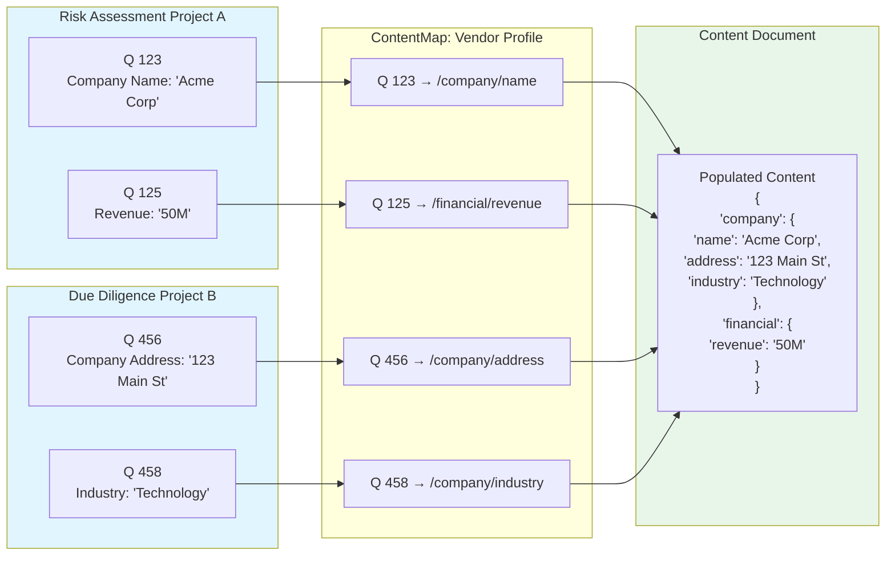

import Callout from '../../components/featureWidgets/Callout.astro';
import Details from '../../components/featureWidgets/Details.astro';

<Callout type="tip" title="From Assessment to Documentation">
Information gathered through questionnaires often needs to be incorporated into business documents—contracts, reports, agreements, and reference databases. Fluvial connects questionnaire responses to document templates, reducing manual data entry.
</Callout>

## The Challenge

After collecting questionnaire data, information typically needs to be transferred into contracts, reports, and other documents. Manual copying can be time-consuming and may introduce errors.

## How Fluvial Works

Fluvial connects documents to questionnaire data through defined mappings.

### Define Your Document Structure

Create templates for the types of documents you need—vendor profiles, compliance reports, service agreements, or rating summaries. These templates define what information each document contains and how it should be organised.

### Connect Questions to Documents

Set up reusable connections between your questionnaire questions and document fields. When a question asks for a company name, certification status, or risk rating, you specify where that information should appear in your documents. These connections can be saved and used again for future assessments.



### Generate and Update Documents

Once connections are established, Fluvial can automatically create documents from questionnaire responses. When source information changes, you can choose to update the documents automatically or review changes before approving them. The system keeps track of what changed, when, and why.

### Share in Any Format

While Fluvial stores document data in a structured way, you can output documents in whatever format you need—PDF for distribution, HTML for web viewing, or data feeds for other systems. Your branding and formatting preferences are maintained in customizable templates.

## Building Organisational Knowledge

Beyond individual projects, Fluvial helps organize information into a reference library. Documents can be organized by the entities they describe (vendors, regions, industries), with access controls and change tracking.

## Real-World Example

**Advisory Firm Building Vendor Intelligence**

An advisory firm conducts vendor evaluations for clients. They use Fluvial to build a database of vendor information.

They create a standard vendor profile template that captures capabilities, certifications, performance history, and risk factors. When conducting a client assessment, questionnaire responses populate these profiles. As they complete more projects, their vendor database grows.

For subsequent client engagements, they can reference existing vendor information while keeping client-specific details confidential. The audit trail documents how assessments were conducted.

Visit our [Solutions](/solutions/) to see how document automation applies to specific industries and use cases.


## Workflow Integration

Documents can move through approval processes with whatever stages you need, e.g. draft, review, approved, and published. Set up requirements for legal or compliance sign-off before documents are finalised, and trigger notifications or system updates when documents reach certain milestones. These [workflows](/features/workflow) can be customised using a [GUI workflow builder](/features/workflow) and simple expression language policies.

<Details summary="Expression Language for Workflow Control">
Control workflow transitions using flexible business rules with Common Expression Language (CEL):

```javascript
// Allow access to vendor profiles for users in procurement or legal
user.roles.contains("procurement") || user.roles.contains("legal")

// Restrict sensitive financial data to senior analysts
entity.data_classification == "financial" && user.seniority >= "senior"

// Organisation-based access control
entity.author_org_id == user.org.id

// Time-based restrictions
now.getHours() >= 9 && now.getHours() < 17
```

These expressions determine who can view, edit, or approve documents, and under what conditions workflow transitions can occur.
</Details>

## What Makes Fluvial Different

Most questionnaire platforms offer basic export features—typically PDFs or spreadsheets.

Fluvial maintains connections between source data and documents. Information can be updated, mappings can be reused across projects, and the system records how documents were created and modified. This transforms your assessment data from isolated project artifacts into organisational assets that compound in value over time.
