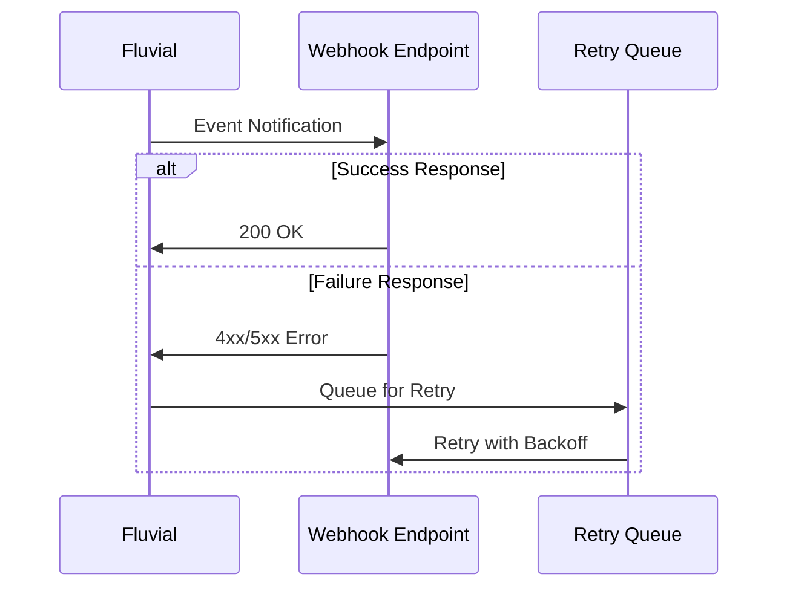
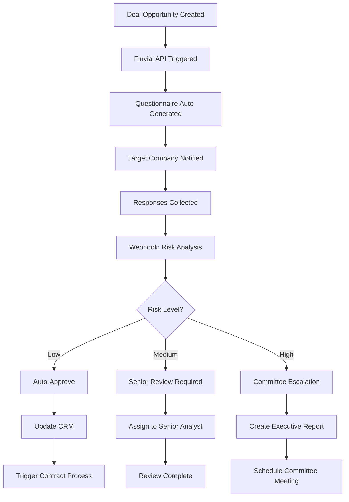
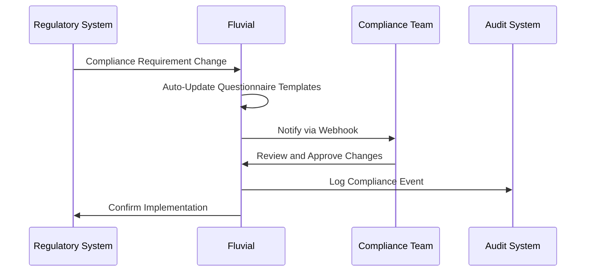

# Integration Platform

::: tip Why Integration Excellence Matters
Fluvial's integration capabilities ensure your questionnaire and workflow processes seamlessly connect with existing business systems. Rather than operating as an isolated tool, Fluvial becomes the orchestration layer that connects due diligence, compliance, and assessment processes across your entire technology ecosystem.
:::

## What Sets Fluvial's Integration Apart?

Unlike basic survey platforms that offer limited export options, Fluvial provides comprehensive integration capabilities designed for enterprise environments where questionnaire data must flow seamlessly between multiple systems, trigger automated processes, and maintain real-time synchronization with business-critical applications.

### Complete API-First Architecture
Every capability available in Fluvial's user interface is accessible through our comprehensive REST APIs:

#### 100% Feature Parity
- **Questionnaire Management** - Create, modify, and deploy questionnaires programmatically
- **Response Collection** - Automated answer submission and validation
- **Workflow Control** - Trigger status transitions and approvals via API
- **Real-Time Analytics** - Access scoring, weighting, and analytical data
- **User Management** - Provision users, assign permissions, and manage access

#### OpenAPI Specification Compliance
::: warning Enterprise Standards
All APIs are fully documented using OpenApi 3.1 specifications, ensuring:
- **Automatic SDK Generation** - Create client libraries in any programming language
- **Interactive Documentation** - Explore and test APIs directly from documentation
- **Contract-First Development** - Guarantee API stability and backward compatibility
- **Integration Testing** - Validate integrations against standardized specifications
:::

#### Developer-Friendly Implementation
```javascript
// Example: Create questionnaire and trigger workflow
const questionnaire = await Fluvial.questionnaires.create({
  title: "Vendor Security Assessment",
  sections: vendorSections,
  workflow: "security-review"
});

// Automatically assign to security team
await Fluvial.workflows.transition(questionnaire.id, 'security-review', {
  assignTo: 'security-team@company.com'
});
```

## Real-Time Event System

### Intelligent Webhook Architecture
Fluvial's webhook system provides real-time notifications for business-critical events, enabling immediate responses to questionnaire activities:

#### Comprehensive Event Coverage
- **Response Events** - Answer submissions, modifications, and validations
- **Workflow Events** - Status transitions, approvals, and rejections  
- **User Events** - Login activities, permission changes, and assignment updates
- **System Events** - Integration failures, performance alerts, and security notifications

#### Smart Event Filtering
::: tip Advanced Event Management
Configure webhooks with filtering rules:
- **Event Type Filtering** - Only receive notifications for specific event categories
- **Project-Based Filtering** - Limit events to specific questionnaires or business units
- **Conditional Logic** - Trigger webhooks based on response content, scoring thresholds, or approval status
- **Rate Limiting** - Prevent webhook flooding while ensuring critical events are delivered
:::

#### Reliable Delivery Guarantees


::: warning Delivery Assurance
- **Automatic Retries** - Exponential backoff for failed deliveries
- **Dead Letter Queues** - Capture permanently failed events for manual review
- **Delivery Confirmation** - Cryptographic signatures verify authentic event delivery
- **Monitoring Dashboards** - Real-time visibility into webhook performance and failures
:::

## Advanced Workflow Automation

### Webhook-Driven Automation
Fluvial's workflow system uses webhooks with guard expressions and CEL data transforms to automate business processes when questionnaires transition between statuses:

#### Event-Driven Automation
When workflow transitions occur, Fluvial sends webhook notifications to configured endpoints with rich context data. Your systems can then execute automated actions:

**Example Webhook Payload:**
```json
{
  "event": "workflow.transition",
  "questionnaire_id": "q_12345",
  "from_status": "security-review",
  "to_status": "approved",
  "scores": {
    "overall": 85,
    "security": 90,
    "compliance": 80
  },
  "responses": { /* response data */ },
  "user": { /* user context */ },
  "timestamp": "2025-10-17T10:30:00Z"
}
```

#### CEL Guard Expressions
Configure webhooks to fire conditionally based on CEL expressions evaluated against event data:

```javascript
// Only trigger for high-risk assessments
scores.overall < 50

// Trigger for specific workflow transitions
transition.to == 'approved' and scores.security > 75

// Complex conditional logic
risk_level == 'high' and department == 'finance' and approval_count < 2
```

#### CEL Data Transforms
Transform webhook payloads before delivery using CEL expressions, enabling you to:
- Extract specific fields for external system consumption
- Calculate derived values from response data
- Format data to match receiving system's schema
- Filter sensitive information before transmission

**Transform Example:**
```javascript
{
  'vendor_id': questionnaire.vendor_id,
  'risk_score': scores.overall,
  'status': transition.to,
  'requires_review': scores.overall < 60,
  'reviewer_email': scores.overall < 60 ? 'senior-analyst@company.com' : 'analyst@company.com'
}
```

#### Automation Use Cases
::: tip Webhook Automation Features
- **Dynamic Routing** - Webhook receivers route work based on response content and risk profiles
- **Conditional Logic** - CEL guards ensure automation only triggers when conditions are met
- **External System Integration** - Update CRM records, create tickets, trigger approval workflows
- **Notification Management** - Send alerts to appropriate teams based on assessment outcomes
- **Document Generation** - Trigger report generation when assessments complete
:::

### Integration Architecture Benefits

**Decoupled Automation** - Business logic lives in your systems, not locked in the platform

**Language Agnostic** - Implement automation in Python, Node.js, Java, or any language that handles HTTP

**Testable** - Mock webhooks during development and test automation independently

**Scalable** - Distribute automation across microservices; scale independently of questionnaire platform

**Flexible** - Change automation logic without platform configuration changes

## Enterprise System Integration

### ERP and Customer Management
::: details ERP Integration Capabilities
- **Automatic Vendor Creation** - Create vendor records from questionnaire responses
- **Risk Profile Updates** - Sync assessment results with vendor risk ratings
- **Relationship Mapping** - Track questionnaire history across vendor relationships
- **Sales Process Integration** - Trigger due diligence workflows from opportunity updates
:::

#### Webhook-Based Salesforce Integration
```python
# Webhook receiver: Update Salesforce opportunity based on due diligence results
@app.post("/webhooks/fluvial/assessment-complete")
async def handle_assessment_complete(event: WebhookEvent):
    if event.scores.overall >= 70:
        sf_client = SalesforceClient(settings.SF_TOKEN)
        
        await sf_client.update_opportunity(event.questionnaire.opportunity_id, {
            "Due_Diligence_Score__c": event.scores.overall,
            "Due_Diligence_Status__c": "Complete",
            "Risk_Rating__c": calculate_risk_rating(event.scores),
            "Next_Review_Date__c": calculate_next_review(event.scores.overall)
        })
        
        return {"status": "salesforce-updated"}
    
    return {"status": "score-too-low", "requires_manual_review": True}
```

### Financial Systems
::: details Financial System Integration
- **Vendor Onboarding** - Automatic creation of vendor master data from approved questionnaires
- **Invoice Processing** - Link questionnaire approval status to payment authorization
- **Budget Planning** - Incorporate vendor risk assessments into procurement budgeting
- **Compliance Reporting** - Feed assessment data into financial compliance reporting systems
:::

### Document Automation Integration
::: warning Document Security
For document automation systems:
- **SharePoint Integration** - Automatic filing of questionnaire responses and supporting documents
- **DocuSign Integration** - Trigger signature workflows for high-risk vendor agreements
- **Box/Dropbox Integration** - Secure file sharing with external parties during questionnaire process
- **Compliance Archives** - Automatic retention and disposal based on regulatory requirements
:::

### Security and Identity Management
::: details Security Integration
- **Single Sign-On (SSO)** - SAML and OAuth integration with enterprise identity providers
- **Multi-Factor Authentication** - Integration with corporate MFA solutions
- **Directory Services** - Automatic user provisioning from Active Directory/LDAP
- **Security Monitoring** - Integration with SIEM systems for access logging and threat detection
:::

## Real-World Integration Scenarios

### Legal Due Diligence Automation


::: details Process Automation Benefits
- **90% faster** questionnaire deployment through automated generation
- **Zero manual routing errors** through webhook-based intelligent routing
- **Real-time stakeholder updates** via webhooks to email, Slack, and project management tools
- **Automatic compliance documentation** through document automation integration
:::

### Financial Services Compliance Orchestration


::: warning Regulatory Compliance
- **Automatic template updates** when regulatory requirements change
- **Complete audit trails** fed directly to compliance monitoring systems
- **Real-time risk monitoring** through integration with risk management platforms
- **Regulatory reporting automation** via direct feeds to regulatory systems
:::

### Vendor Assessment Ecosystem
::: details Multi-System Vendor Management
**Procurement System Integration:**
- Trigger vendor assessments from purchase requisitions
- Block purchase orders for vendors without current risk assessments
- Automatically update vendor master data with assessment results

**Financial System Integration:**
- Link payment authorization to vendor risk status
- Generate vendor risk reports for financial planning
- Alert finance teams to high-risk vendor relationships

**Legal System Integration:**
- Trigger contract review processes based on vendor risk scores
- Automatically generate vendor-specific contract terms based on risk assessment
- Maintain legal document libraries linked to vendor assessments
:::

## Developer Experience

### Comprehensive SDK Support
::: tip Developer-Friendly
- **Multiple Language SDKs** - Python, JavaScript, Java, C#, and Go
- **Code Examples** - Complete implementation examples for common integration patterns
- **Interactive Testing** - Sandbox environments for testing integrations
- **Version Management** - Backward-compatible API versions with clear migration paths
:::

### Advanced Testing and Monitoring
- **Integration Testing Suite** - Automated testing for webhook delivery and API responses
- **Performance Monitoring** - Real-time metrics on API response times and success rates
- **Error Handling** - Detailed error codes and troubleshooting guidance
- **Rate Limiting** - Intelligent throttling with burst capacity for enterprise usage patterns

## Competitive Advantages

### Flexible Integration
::: warning Market Differentiation
While basic survey tools offer CSV export and basic webhooks, Fluvial provides:
- **Complete API coverage** enabling full automation of questionnaire processes
- **Webhook automation** with CEL guard expressions and data transforms
- **System integration** with Cyber security data, ERP, and document automation platforms
- **Real-time event processing** with guaranteed delivery and comprehensive filtering
:::

### Regulatory Compliance Integration
::: danger Compliance Requirements
Built specifically for regulated industries requiring:
- **Complete API audit trails** - Every integration call logged for regulatory review
- **Data sovereignty controls** - API access controls that respect data residency requirements
- **Integration validation** - Cryptographic verification of data integrity across system boundaries
- **Compliance reporting APIs** - Direct feeds to regulatory reporting systems
:::

### Advanced Automation Capabilities
::: tip Business Process Excellence
- **Intelligent routing** based on questionnaire content analysis via webhook receivers
- **Predictive scoring** through machine learning integration APIs
- **Dynamic questionnaire generation** based on external system data
- **Multi-system orchestration** enabling complex business process automation through webhook chains
:::

## Getting Started

### Implementation Approach
1. **API Discovery** - Explore capabilities using interactive OpenAPI documentation
2. **Webhook Configuration** - Set up event notifications for critical business processes with CEL guards
3. **Pilot Integration** - Implement one key integration to validate approach and performance
4. **Workflow Automation** - Deploy webhook receivers for business process automation
5. **Full Ecosystem Integration** - Connect all relevant systems for complete process automation

### Success Metrics
Organizations typically achieve:
- **80-95% reduction** in manual questionnaire administration through API automation
- **60-90% faster** response processing through webhook-driven notifications
- **Zero integration failures** through reliable webhook delivery and comprehensive error handling
- **100% audit compliance** through complete API activity logging and integration validation

---

Fluvial's integration platform transforms questionnaire management from a manual, isolated process into an automated, connected component of your enterprise technology ecosystem, delivering unprecedented efficiency while maintaining the rigorous controls required in regulated environments.