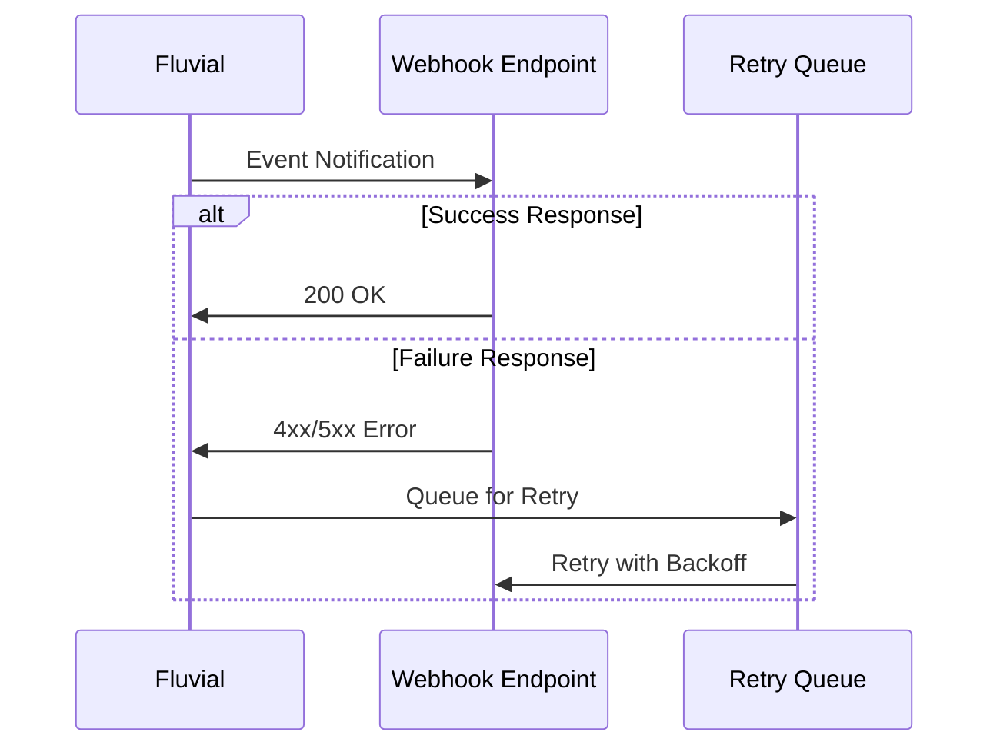
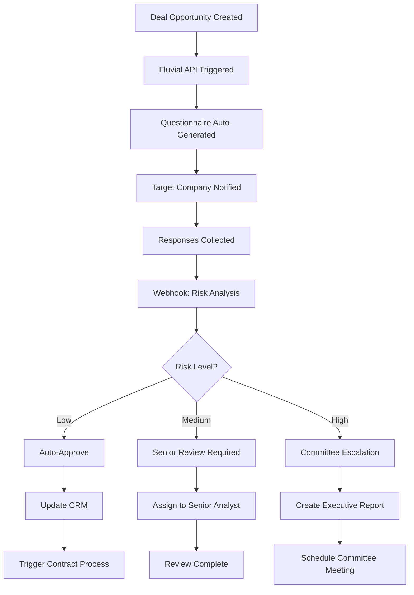
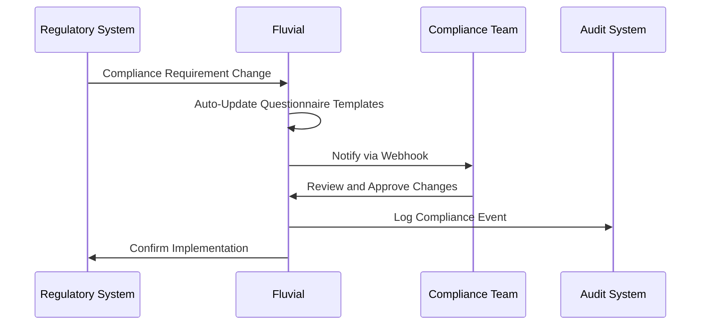

import Callout from '../../components/featureWidgets/Callout.astro';

<Callout type="tip" title="Why Integration Matters">
Fluvial's integration capabilities ensure your questionnaire and workflow processes seamlessly connect with existing business systems. Rather than operating as an isolated tool, Fluvial becomes the orchestration layer that connects due diligence, compliance, and assessment processes across your entire technology ecosystem.
</Callout>


## API-First Design

Every feature in Fluvial's user interface is accessible through REST APIs. This includes questionnaire management, response collection, workflow control, analytics, and user administration.

### OpenAPI Documentation

All APIs follow OpenAPI 3.1 specifications, providing interactive documentation and enabling automatic client library generation for different programming languages.

```javascript
// Example: Create questionnaire and trigger workflow
const questionnaire = await fluvial.questionnaires.create({
  title: "Vendor Security Assessment",
  sections: vendorSections,
  workflow: "security-review"
});

await fluvial.workflows.transition(questionnaire.id, 'security-review', {
  assignTo: 'security-team@company.com'
});
```

## Webhook System

Fluvial sends HTTP notifications when events occur, such as response submissions, workflow transitions, or user actions. Webhooks can be configured to filter events by type, project, or content conditions.

### Delivery Reliability



Failed webhook deliveries are automatically retried with exponential backoff. Permanently failed events are captured for review, and all deliveries include cryptographic signatures for verification.

## Workflow Automation

Webhooks can trigger external automation when questionnaires transition between workflow statuses. The webhook payload includes response data, scores, and context that receiving systems can use to execute business logic.

**Example Webhook Payload:**
```json
{
  "event": "workflow.transition",
  "questionnaire_id": "q_12345",
  "from_status": "security-review",
  "to_status": "approved",
  "scores": {
    "overall": 85,
    "security": 90,
    "compliance": 80
  },
  "responses": { /* response data */ },
  "user": { /* user context */ },
  "timestamp": "2025-10-17T10:30:00Z"
}
```

### Conditional Execution with CEL

Webhook delivery can be controlled using Common Expression Language (CEL) guard expressions:

```javascript
// Only trigger for high-risk assessments
scores.overall < 50

// Trigger for specific workflow transitions
transition.to == 'approved' && scores.security > 75

// Complex conditional logic
risk_level == 'high' && department == 'finance' && approval_count < 2
```

### Data Transformation

CEL expressions can also transform webhook payloads before delivery, allowing you to extract specific fields, calculate derived values, or format data for external systems:

```javascript
{
  'vendor_id': questionnaire.vendor_id,
  'risk_score': scores.overall,
  'status': transition.to,
  'requires_review': scores.overall < 60,
  '
}
```

This approach keeps business logic in your systems rather than locked in platform configuration. Automation can be implemented in any language that handles HTTP requests, tested independently, and scaled separately from the questionnaire platform.

## Enterprise System Integration

### CRM and ERP Systems

Fluvial can integrate with customer relationship management and enterprise resource planning systems to automate vendor creation, update risk profiles, and trigger due diligence workflows.

**Webhook-Based Salesforce Example:**

Configure a webhook with a CEL transformation expression to map Fluvial event data to Salesforce's expected format:

```javascript
// CEL transform expression for Salesforce opportunity update
{
  'opportunity_id': questionnaire.opportunity_id,
  'fields': {
    'Due_Diligence_Score__c': scores.overall,
    'Due_Diligence_Status__c': transition.to == 'approved' ? 'Complete' : 'In Progress',
    'Risk_Rating__c': scores.overall >= 80 ? 'Low' : 
                      scores.overall >= 60 ? 'Medium' : 'High',
    'Next_Review_Date__c': scores.overall >= 70 ? 
                           timestamp.addDuration(duration('365d')).format('2006-01-02') :
                           timestamp.addDuration(duration('90d')).format('2006-01-02'),
    'Security_Score__c': scores.security,
    'Compliance_Score__c': scores.compliance,
    'Requires_Manual_Review__c': scores.overall < 60
  }
}
```

This transformation runs within Fluvial before the webhook is delivered, eliminating the need for intermediate processing services. The webhook endpoint receives data already formatted for Salesforce's API.

### Document Management

Document automation systems like SharePoint, DocuSign, and Box can be integrated for automatic filing, signature workflows, and secure file sharing during the questionnaire process.


## Integration Patterns

### Legal Due Diligence Automation



### Financial Services Compliance



<Callout type="info" title="Audit Trails">
All API calls and webhook deliveries are logged for regulatory review. Integration activity can be included in compliance reporting feeds.
</Callout>

## Developer Resources

SDKs are available for Python, JavaScript, Java, C#, and Go. The platform provides sandbox environments for testing integrations, detailed error codes for troubleshooting, and performance monitoring for API response times and success rates.

## Getting Started

Organizations typically begin by exploring the OpenAPI documentation, configuring webhooks for critical business processes, and implementing a pilot integration to validate the approach. After successful validation, additional systems can be connected to build comprehensive process automation.

---