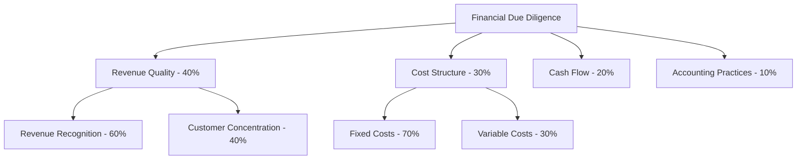

import Callout from '../../components/featureWidgets/Callout.astro';

<Callout type="tip" title="Why Questionnaire Excellence Matters">
Fluvial's questionnaire system transforms how organisations create, deploy, and analyse complex assessments. Whether you're conducting due diligence, compliance reviews, vendor assessments, or risk evaluations, our platform provides professional questionnaire capabilities that scale with your business needs.
</Callout>

## What Makes Fluvial's Questionnaires Different?

Unlike simple survey tools, Fluvial questionnaires are designed for mission-critical business processes where accuracy, control, and analytical depth are paramount. Our system provides the flexibility to handle everything from simple compliance checklists to complex multi-party due diligence exercises.

### Question Building
Create flexible questions using multiple input types:
- **Rich Text Fields** - Multi-line responses with formatting support and validation rules
- **Multiple Choice Options** - Radio buttons and dropdown selections with automated scoring
- **Checkboxes** - Boolean responses for compliance and verification requirements
- **File Attachments** - Supporting documents, evidence, and supplementary materials
- **Embedded Media** - Links to external resources, videos, and reference materials

### Intelligent Question Organisation
<Callout type="warning" title="Key Differentiator">
Fluvial's hierarchical section system allows unlimited nesting of topics and subtopics, enabling you to mirror complex organisational structures and regulatory frameworks exactly as they exist in your business domain.
</Callout>

## Sophisticated Weighting and Scoring

### Multi-Dimensional Scoring System
Unlike basic survey tools that treat all questions equally, Fluvial provides flexible scoring capabilities:

#### Flexible Weighting Strategies
- **Question-Level Weights** - Assign importance to individual questions
- **Section-Level Weights** - Weight entire categories or compliance areas
- **Multiple Weighting Sets** - Different scoring perspectives for the same questionnaire
- **Normalised Calculations** - Automatically adjust scores when questionnaire structure changes

#### Automated Scoring Intelligence
<Callout type="tip" title="Smart Scoring Features">
- **Multiple Choice Auto-Scoring** - Pre-configured point values for standardized responses
- **AI-Powered Qualitative Analysis** - Machine learning assessment of free-text responses
- **Relative Scoring Algorithms** - Compare responses across multiple respondents
- **Custom Scoring Rules** - Define complex business logic for specialised assessments
</Callout>

### Real-World Scoring Example

<Callout type="info" title="Advanced Weighting Benefits">
This allows the same questionnaire to be scored differently for various stakeholders - legal teams might weight compliance higher, while financial teams prioritize revenue quality.
</Callout>

## Collaborative Response Management

### Status-Driven Response Workflow
For respondents, aach question can progress through a workflow:

- **Not Answered** - Initial state, awaiting respondent input
- **Answered** - Response provided, ready for review
- **For Review** - Flagged for expert evaluation
- **Rejected** - Requires revision or additional information
- **Approved** - Validated and accepted by reviewers

### Multi-Party Collaboration
<Callout type="warning" title="Enterprise Requirement">
Unlike consumer survey tools, Fluvial supports complex multi-stakeholder scenarios where different users have different roles and permissions within the same questionnaire.
</Callout>

#### Role-Based Access Control
- **Section-Level Permissions** - Control who can see and respond to specific areas
- **Response Assignment** - Allocate questions to specific team members
- **Review Hierarchies** - Multi-tier approval processes for critical responses
- **Audit Trails** - Complete history of who answered what and when

## Content Reusability and Efficiency

### Questionnaire Template System
<Callout type="tip" title="Productivity Multiplier">
Create questionnaire libraries that can be reused across projects, ensuring consistency while dramatically reducing setup time for similar assessments.
</Callout>

#### Import and Export Capabilities
- **Section Import** - Reuse proven question sets across multiple projects
- **Spreadsheet Integration** - Import existing questionnaires from Excel or CSV
- **Template Libraries** - Build organisational knowledge bases of proven assessment frameworks
- **Cross-Project Sharing** - Leverage successful questionnaires across different business units

#### Version Control and Evolution
- **Template Versioning** - Track improvements to questionnaire designs over time
- **Change Impact Analysis** - Understand how modifications affect existing projects
- **Best Practice Evolution** - Continuously improve questionnaire effectiveness based on response quality

## Advanced Integration Capabilities

### API-First Architecture
<Callout type="info" title="Integration Benefits">
Fluvial's comprehensive APIs allow questionnaires to integrate seamlessly with existing business systems, enabling automated data population and real-time scoring updates.
</Callout>

#### System Integration Options
- **CRM Integration** - Automatically populate vendor and client information
- **Document Automation** - Link to existing document repositories and compliance systems
- **Analytics Platforms** - Feed questionnaire data into business intelligence tools
- **Approval Systems** - Integrate with existing workflow and approval infrastructure

#### Data Source Integration
- **Reference Sections** - Automatically populate sections from external databases
- **Third-Party Data** - Integration with regulatory databases, financial systems, and compliance platforms
- **Real-Time Updates** - Dynamic questionnaire content based on external data changes

## Competitive Advantages

### Scalable Architecture
<Callout type="warning" title="Market Differentiation">
While basic survey tools struggle with complex business requirements, Fluvial handles:
- Unlimited questionnaire complexity and nesting
- Sophisticated multi-party collaboration workflows
- Advanced scoring and analytical capabilities
- Detailed audit history
</Callout>

### Advanced Analytics and Reporting
<Callout type="tip" title="Business Intelligence Integration">
Transform questionnaire responses into actionable business intelligence:
- **Comparative Analysis** - Benchmark responses across vendors, time periods, or business units
- **Trend Identification** - Identify patterns in responses that indicate emerging risks or opportunities
- **Predictive Scoring** - AI-powered analysis that predicts likely outcomes based on response patterns
- **Executive Dashboards** - High-level views of questionnaire completion status and key findings
</Callout>

### Regulatory Compliance Support
<Callout type="danger" title="Compliance Requirements">
Built specifically for regulated industries where questionnaire accuracy and auditability are legal requirements:
- **Complete Audit Trails** - Who answered what, when, and how responses were validated
- **Version Control** - Track questionnaire evolution for regulatory reporting
- **Access Logging** - Detailed records of who accessed sensitive information
- **Data Retention** - Configurable retention policies that meet regulatory requirements
</Callout>

## Getting Started

### Implementation Approach
1. **Assessment Planning** - Work with our experts to map your current questionnaire processes
2. **Template Development** - Create reusable questionnaire templates for your most common use cases
3. **Integration Design** - Plan connections to your existing business systems and data sources
4. **Pilot Deployment** - Test with a limited scope to validate approach and train users
5. **Full Rollout** - Deploy across your organisation with ongoing support and optimisation

### Success Metrics
Organisations typically see:
- **60-80% reduction** in questionnaire setup time through template reuse
- **40-60% improvement** in response quality through structured workflows and validation
- **90% reduction** in manual scoring effort through automated analysis
- **Complete audit compliance** for regulatory questionnaire requirements

## Future-Ready Features

### AI and Machine Learning
<Callout type="tip" title="Innovation Pipeline">
Fluvial's AI integration roadmap includes:
- **Intelligent Question Suggestions** - ML-powered recommendations for questionnaire improvement
- **Response Quality Analysis** - Automated assessment of answer completeness and accuracy
- **Predictive Risk Scoring** - AI models that identify high-risk responses requiring additional scrutiny
- **Natural Language Processing** - Advanced analysis of free-text responses for sentiment and key themes
</Callout>

### Advanced Automation
- **Dynamic Questionnaire Generation** - AI-powered creation of questionnaires based on specific assessment requirements
- **Smart Routing** - Automatically assign questions to the most qualified respondents
- **Intelligent Follow-up** - Automated generation of clarifying questions based on initial responses

---

Fluvial's questionnaire system represents the evolution from simple data collection to sophisticated business intelligence gathering. It's designed for organisations where the quality of information gathered directly impacts critical business decisions, regulatory compliance, and strategic outcomes.

