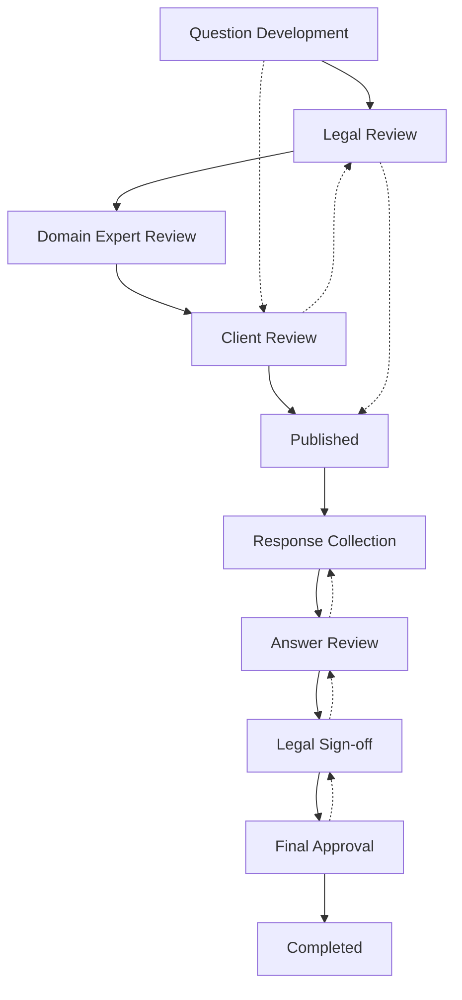
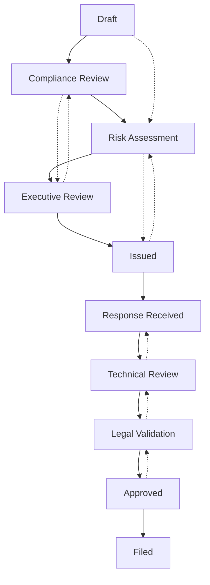
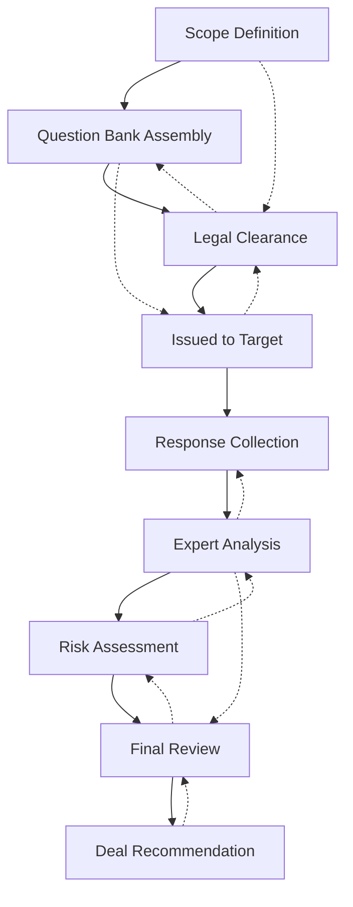

import Callout from '../../components/featureWidgets/Callout.astro';
import Details from '../../components/featureWidgets/Details.astro';

<Callout type="tip" title="Why Workflows Matter">
Fluvial provides flexible workflow management that allows organisations to define custom business processes for their projects and other key activities. Instead of being locked into fixed, predetermined steps, you can create workflows that match your specific operational requirements.
</Callout>


Fluvia provides the ability to:
- Track individual approvals against specific entities
- Gate transitions based on approval status
- Maintain detailed audit trails of who approved what and when
- Configure complex, multi-tier approval requirements
- Write business logic in human-readable guard expressions
- Coordinate workflows across nested entity hierarchies


<Callout type="danger" title="Readable Business Logic">
**Traditional Systems:** Endless configuration screens, rigid rules, project-specific settings that multiply complexity.

**Fluvial's Approach:** Write business logic in readable expressions that capture your requirements.

```
// Replace configuration with clear rules
user.department == 'legal' && approval.risk_assessment <= 'medium' 
  || user.role == 'managing_partner'
```
</Callout>

### What Are Workflows?

A workflow defines the lifecycle of business objects in your organisation - such as projects, issues, or procurement processes. Each workflow consists of:

- **Statuses** - The different stages an item can be in (e.g., "Draft", "Under Review", "Published", "Closed")
- **Transitions** - The allowed movements between statuses (e.g., moving from "Draft" to "Under Review")
- **Actions** - What users can do at each status (e.g., edit details, approve, reject, publish)

## Benefits

### Organisational Flexibility
Different organisations have different processes. Fluvial workflows adapt to your existing business rules rather than forcing you to change how you work.

### Version Control
Workflows are versioned, allowing you to evolve your processes over time while maintaining historical consistency for existing projects.

### Permission Integration
Each status defines exactly what actions users can perform, ensuring proper governance and access control throughout your processes.

### Customisable Business Logic
Advanced users can define custom rules that determine when transitions are allowed and what happens during status changes.

## How Workflows Work

### Status-Based Permissions
At any given status, users only see the actions they're permitted to perform. 

<Callout type="info" title="Permission Examples">
- **Draft** status: Authors can edit, save, or submit for review
- **Under Review** status: Reviewers can approve, reject, or request changes
- **Published** status: Limited users can archive or create amendments
</Callout>

### Controlled Transitions
Moving between statuses is controlled and auditable. Users can only make transitions that are explicitly defined and for which they have permission.


<Callout type="tip" title="Approval-Gated Transitions">
Workflows can require formal approvals before allowing critical transitions. The system tracks who has approved what, and transition rules can verify that required approvals are in place before proceeding.
</Callout>

### Guard Expressions - Business Logic in Readable form

Fluvial uses "CEL" (Common Expression Language), a readable and industry-standard expression language that lets you write complex business rules without programming. Instead of endless configuration screens, you write logical conditions that are simple to understand and maintain.


**Access Control Example:**
```
user.roles.contains('admin') || resource.owner == user.id
```

**Data Filtering Example:**
```
created_at.within(duration('24h')) && status == 'pending'
```

**Workflow Conditions Example:**
```
approval.status == 'approved' && budget.remaining >= cost
```

<Callout type="info" title="Guard Expressions">
Guard expressions provide a readable way to define business rules. Instead of multiple configuration screens, you write logical conditions that capture your requirements.
</Callout>

### Context-Aware Rules
Workflows can incorporate business rules that consider the current state of the project, user roles, deadlines, approval status, and other contextual factors.

### Nested Workflow Scopes
<Callout type="tip" title="Hierarchical Business Logic">
Fluvial supports nested workflow scopes where parent and child entities can have independent workflows that interact intelligently. A **Project** contains many **Responses**, each with their own workflow, but child workflows can trigger parent transitions when guard conditions are met.
</Callout>

**Example: Coordinated Transition Logic**
- Child **Response** workflows attempt to transition parent **Project** from "Responding" to "Scoring"
- Parent transition only fires when guard condition is satisfied:

```
all_responses.all(r, r.status == 'submitted') && responses.size() >= minimum_required
```

<Callout type="info" title="Business Logic">
This expresses the business rule *"All responses shall be considered over the same period of time"* in readable logic.
</Callout>

## Workflow Management

### Creating Workflows
Administrators can create new workflows for different types of business processes. Each workflow is specific to:
- A particular entity type (projects, issues, etc.)
- Your organisation
- A specific version for change management

### Workflow Designer
The workflow designer provides a visual interface for:
- Defining statuses and their properties
- Setting up transitions between statuses
- Configuring permissions for each status
- **Writing guard expressions in -English CEL language**
- Adding business rules and validation logic
- Specifying required approvals for transitions
- **Creating cross-scope transition logic between parent and child workflows**

### Deployment and Testing
New workflows can be tested and refined before being deployed to live operations, ensuring business continuity during process improvements.

## Real-World Examples

### Due Diligence Questionnaire Lifecycle




- **Legal Review** requires lawyer approval before questions can be published
- **Answer Review** requires domain expert approval of all responses
- **Legal Sign-off** requires legal counsel approval of final answers before completion


<Details summary="Guard Expression Examples">
**Legal Review Transition:**
```
approvals.legal.size() >= 1 && approvals.legal.exists(a, a.role == 'corporate_counsel')
```

**Answer Review to Legal Sign-off:**
```
responses.all(r, r.status == 'expert_approved') && risk_level <= 'medium'
```

**High-Risk Escalation:**
```
risk_level == 'high' && approvals.size() >= 2 && approvals.exists(a, a.role == 'partner')
```
</Details>

### Regulatory Compliance Questionnaire



<Callout type="warning" title="Advanced Approval Requirements">
- **Executive Review** requires board level approval for high-risk questionnaires
- **Legal Validation** requires both in-house and external counsel approval
- **Filed** status only available after all required regulatory approvals logged
</Callout>

### M&A Due Diligence Process



<Callout type="danger" title="Multi-Tier Approval Example">
- **Legal Clearance** requires approval from corporate counsel and external M&A specialists
- **Final Review** requires sign-off from deal team lead, legal counsel, and subject matter experts in each domain covered
</Callout>

## Getting Started

1. **Review Default Workflows** - Fluvial comes with sensible default workflows that work for most organisations
2. **Map Your Approval Requirements** - Identify who needs to approve what at each stage of your processes
3. **Identify Business Rules** - Document the logical conditions that govern when transitions should occur
4. **Write Guard Expressions** - Convert business rules into readable CEL expressions
5. **Design Custom Workflows** - Use the workflow designer to create processes that match your requirements and approval gates
6. **Configure Cross-Scope Logic** - Set up parent-child workflow coordination where needed
7. **Test and Refine** - Validate new workflows with a small team before full deployment
8. **Train Users** - Ensure your team understands the new processes, their roles, and approval responsibilities

## Advanced Features

<Callout type="tip" title="Advanced Approval Features">
Define complex approval requirements such as:
- Multiple approvals required from different roles
- Escalation rules when approvals are overdue
- Conditional approvals based on risk levels or content analysis
- Sequential vs. parallel approval workflows
</Callout>

<Callout type="tip" title="Readable Business Logic">
Define custom business rules using the semi-technical **CEL** expression language. Control when transitions can occur based on project data, user attributes, approval status, external conditions, and business calendars - all without programming.
</Callout>

**Example Rules:**
```
// Prevent weekend submissions
!(submission_date.getDayOfWeek() in [0, 6])

// Require senior approval for large budgets  
budget.total > 100000 && approvals.exists(a, a.seniority >= 'director')

// Coordinate parent-child workflows
child_workflows.all(w, w.status in ['completed', 'approved'])
```

### Integration Capabilities
Workflows can trigger external system calls, send notifications, update dashboards, and integrate with other business applications when approvals are received or transitions occur.

### Audit and Compliance Reporting
Complete audit trails show:
- How items move through workflows
- Who provided approvals and when
- Any approval exceptions or escalations
- Full compliance history for regulatory requirements

### Multi-Organisation Support
Large enterprises can define different workflows for different business units while maintaining consistent approval standards and governance requirements across the organisation.

## Competitive Advantage

<Callout type="info" title="Approval Tracking">
Fluvial provides granular approval controls including:
- Individual approval tracking against specific entities
- Transition gating based on approval status
- Detailed audit trails of approvals
- Multi-tier approval configuration

This makes Fluvial suitable for legal, financial services, healthcare, and other regulated industries where formal approval processes are required.
</Callout>

---

Workflow customisation transforms Fluvial from a assessment tool into a platform that supports unique business processes, improving efficiency while maintaining the rigorous controls and approval processes required in regulated environments.

